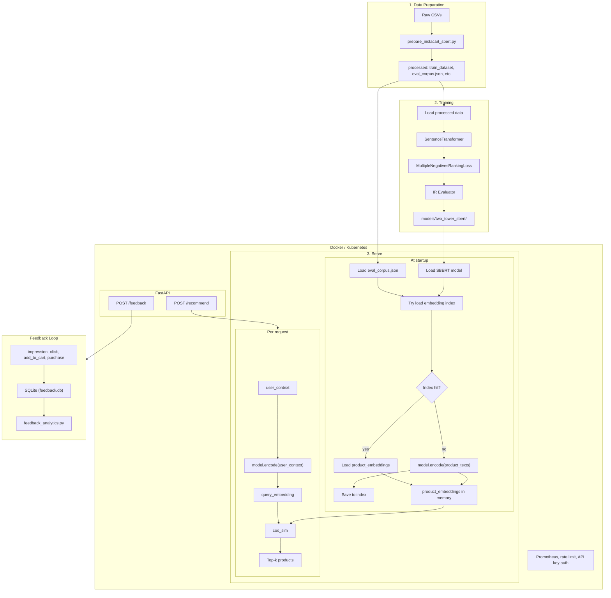
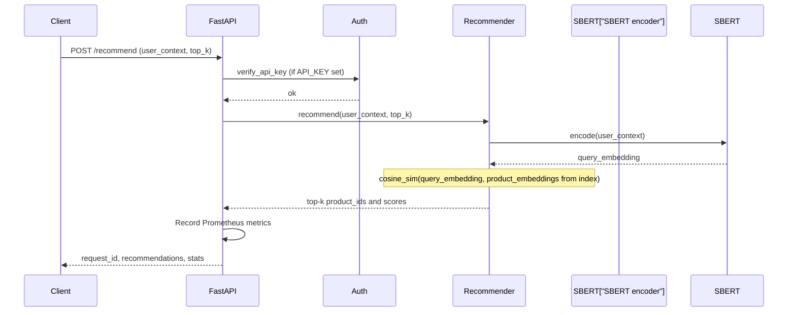
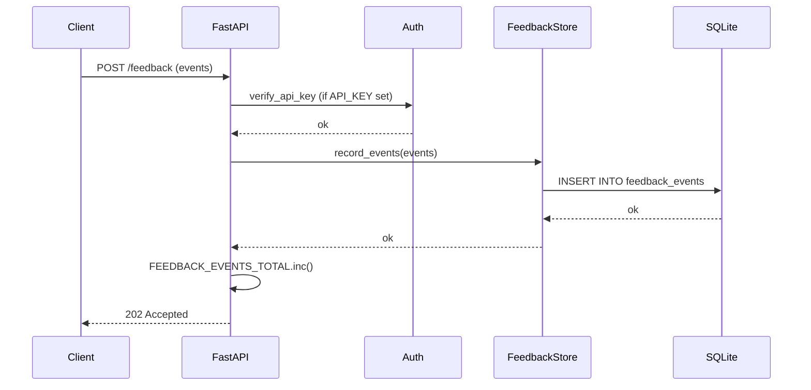

# Instacart Next-Order Recommendation API — Architecture

## Overall Architecture

```mermaid
flowchart TB
    subgraph Data["1. Data Preparation"]
        direction TB
        CSV["Raw CSVs"]
        PREP["prepare_instacart_sbert.py"]
        OUT["processed: train_dataset, eval_corpus.json, etc."]
        CSV --> PREP --> OUT
    end

    subgraph Train["2. Training"]
        direction TB
        LOAD_TRAIN["Load processed data"]
        SBERT["SentenceTransformer"]
        LOSS["MultipleNegativesRankingLoss"]
        IR_EVAL["IR Evaluator"]
        CHECKPOINT["models/two_tower_sbert/"]
        OUT --> LOAD_TRAIN
        LOAD_TRAIN --> SBERT --> LOSS --> IR_EVAL --> CHECKPOINT
    end

    subgraph Deploy["Docker / Kubernetes"]
        direction TB
        subgraph Serve["3. Serve"]
            direction TB
            subgraph Startup["At startup"]
                direction TB
                CORPUS_LOAD["Load eval_corpus.json"]
                MODEL["Load SBERT model"]
                INDEX_TRY["Try load embedding index"]
                IDX_HIT{"Index hit?"}
                INDEX_LOAD["Load product_embeddings"]
                ENCODE_CORPUS["model.encode(product_texts)"]
                SAVE_IDX["Save to index"]
                PEMB["product_embeddings in memory"]
                OUT --> CORPUS_LOAD
                CHECKPOINT --> MODEL
                CORPUS_LOAD --> INDEX_TRY
                MODEL --> INDEX_TRY
                INDEX_TRY --> IDX_HIT
                IDX_HIT -->|yes| INDEX_LOAD --> PEMB
                IDX_HIT -->|no| ENCODE_CORPUS --> SAVE_IDX
                ENCODE_CORPUS --> PEMB
            end

            subgraph PerRequest["Per request"]
                direction TB
                REQ["user_context"]
                QE["model.encode(user_context)"]
                QEMB["query_embedding"]
                COS_SIM["cos_sim"]
                TOP_K["Top-k products"]
                REQ --> QE --> QEMB --> COS_SIM --> TOP_K
                PEMB --> COS_SIM
            end
        end

        subgraph API["FastAPI"]
            R_REC["POST /recommend"]
            R_FB["POST /feedback"]
        end

        PROM["Prometheus, rate limit, API key auth"]
    end

    subgraph Feedback["Feedback Loop"]
        direction TB
        EVENTS["impression, click, add_to_cart, purchase"]
        SQLITE["SQLite (feedback.db)"]
        ANALYTICS["feedback_analytics.py"]
        EVENTS --> SQLITE --> ANALYTICS
    end

    R_REC --> PerRequest
    R_FB --> Feedback
```

## Request Flow: POST /recommend

```mermaid
sequenceDiagram
    participant Client
    participant FastAPI
    participant Auth
    participant Recommender
    participant SBERT["SBERT encoder"]

    Client->>FastAPI: POST /recommend (user_context, top_k)
    FastAPI->>Auth: verify_api_key (if API_KEY set)
    Auth-->>FastAPI: ok
    FastAPI->>Recommender: recommend(user_context, top_k)
    Recommender->>SBERT: encode(user_context)
    SBERT-->>Recommender: query_embedding
    Note over Recommender: cosine_sim(query_embedding, product_embeddings from index)
    Recommender-->>FastAPI: top-k product_ids and scores
    FastAPI->>FastAPI: Record Prometheus metrics
    FastAPI-->>Client: request_id, recommendations, stats
```

## Request Flow: POST /feedback

```mermaid
sequenceDiagram
    participant Client
    participant FastAPI
    participant Auth
    participant FeedbackStore
    participant SQLite

    Client->>FastAPI: POST /feedback (events)
    FastAPI->>Auth: verify_api_key (if API_KEY set)
    Auth-->>FastAPI: ok
    FastAPI->>FeedbackStore: record_events(events)
    FeedbackStore->>SQLite: INSERT INTO feedback_events
    SQLite-->>FeedbackStore: ok
    FeedbackStore-->>FastAPI: ok
    FastAPI->>FastAPI: FEEDBACK_EVENTS_TOTAL.inc()
    FastAPI-->>Client: 202 Accepted
```
